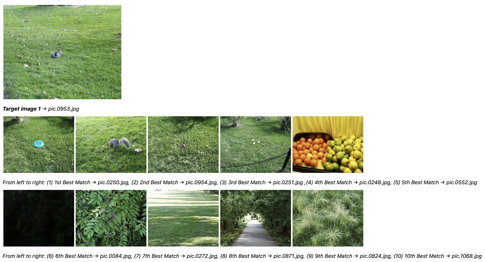

# Project 2: Content-based image retrieval
## Project Description

Content-based image retrieval, when applied to computer vision, searches through image databases by image content as opposed to associated text. In this project, we are analyzing and manipulating images at the pixel level in order to match images via pattern recognition. The images were analyzed based on color, texture, and spatial layout. While implementing the program, we had to consider color spaces, histograms, spatial features, and texture features.

This is a command line program that computes the features of a target image, computes the features of each directory image, computes the distance between the target image and each directory image according to a distance metric, sorts the directory images according to their distance from the target image, and returns the top N matches. When using distance metrics, the smaller the distance between two images, the more similar they will be. The matching methods I implemented include sum square difference, histogram intersection, and histogram intersection with weighted averaging to combine the distances between the different histograms. The feature types include a 9x9 center crop of the image, an rg histogram, a multi-histogram (the first is the rg histogram of the center 9x9 crop and the second is the rg histogram of the whole image), a texture/color histogram (the texture histogram is grayscale gradient magnitude and the color is an rg histogram), and a custom built feature type that only collects the green values from an rg histogram.  

## Instructions for running  executables: 
```
1. Place all .cpp files, .h files, the CMakeLists.txt file, and a newly created "outputfile.csv" file into a directory (i.e. called "project2")
2. Open "project2" in Visual Studio Code
3. Build "project2" using the "CMake Tools" extension
4. Run the program in the command line by first entering "./project2 " followed by the required command line arguments (please refer to "Command Line Arguments" below)
5. **NOTE**: Every time you use a new feature type, new data needs to be written to a csv file. There is no implementation for clearing the csv file so the outputfile needs to be manually deleted and recreated.
```

### Command Line Arguments:
```
argv0: ./project2 

argv1: target image path

argv2: image directory path (folder of images where target image is located)

argv3: csv file path (NOTE: you need to create a csv file called "outputfile.csv")

argv4: feature type (enter b, h, m, or t)
* "b" = 9x9 center crop (calls the "process_baseline" function in features.cpp) 
* "h" = RG histogram (calls the "histogram" function in features.cpp)
* "m" = multi-histogram (calls the "multi_hist" function in features.cpp)
* "t" = texture and color (calls the "texturecolor" function in features.cpp)

argv5: matching method (enter ssd, histx, multix, tcx)
* "ssd" = sum square difference (calls the "ssd" function in distance.cpp)
* "histx" = (calls the "histx" function in distance.cpp)
* "multix" = (calls the "multi_histx" function in distance.cpp)
* "tcx" = (calls the "texturecolor_histx" function in distance.cpp)

argv6: # images N to return
```

## Features and Sample Results

### Feature 1
* Feature Type: 9x9 center crop
* Distance Metric: Sum Square Difference


* Description: The feature type was all of the Vec3b color channel values from the cv::Mat matrix in a 9x9 center crop of the image. Sum square difference computed the sum of all the feature set values for the target and directory image, found the difference of sums for the target image and each directory image, then squared the difference. Sum square difference is a distance metric for comparing two image feature sets, so the smaller the sum square difference value is for two images the more similar they are. As a result, comparing the target image against itself resulted in a a sum square difference of 0, and the sum square difference outputs for the top matches had the smallest values out of all the images in the directory. It seems that since the feature type was a 9x9 center crop of the image, and the target image has a red object in the center, all of my top matches had something red in the center.
* SSD Results:
```
pic.1016.jpg: 0.000000
pic.0986.jpg: 39056.000000
pic.0641.jpg: 49795.000000
pic.0547.jpg: 83417.000000
```

### Feature 2
* Feature Type: RG Histogram
* Distance Metric: Histogram Intersection


* Description: The feature type was a whole image rg chromaticity histogram using 16 bins for each of r and g and histogram intersection as the distance metric. In order to compute the rg histogram, take note of a few things in order to prevent obtaining any invalid index values. For instance, in order to obtain the r index we would compute it as: r index = number of bins * r / (r + g + b + 1). It was important to add 1 to the denominator so that there is no division by 0 error, as well as no cases where the index is out of bounds. Histogram intersection is a similarity metric, as opposed to a distance metric like the sum squared difference. As a result, it is important to note that the similarity metric value will be larger the more similar two images are. In order to make it so that we could sort the outputs so that the smaller values would indicate the best matches, we subtracted each histogram intersection value from 1. In order to obtain the histogram intersection value, we loop through each feature set value in the target image and each directory image by index, find the minimum value, and sum all of the minimum values. While we made this comparison, we also normalized each feature set value in real-time by dividing each feature set value by the sum of all the feature set values in the image. After normalization and subtracting the intersection values from 1, the values were expected to be in the range of 0 to 1, with 0 indicating the best match and 1 indicating a non-match. 

* Histogram Intersection Results:
```
pic.0164.jpg: 0.000000
pic.0080.jpg: 0.304071
pic.0898.jpg: 0.326737
pic.0461.jpg: 0.370746
```

### Feature 3
* Feature Type: Multi-Histogram
* Distance Metric: Histogram Intersection & weighted averaging to combine the distances between the different histograms


* Description: For this feature set I opted to calculate the rg chromaticity histogram as used in Task 2, for a 9x9 center crop and another rg chromaticity histogram for the entire image. The feature sets were initially populated into separate feature vectors for each histogram, then concatenated. Since I concatenated the two feature sets (one feature set appended to the end of another), I knew that the first half of the final feature set would be for the center crop and the last half of the feature set would be for the whole image. Using this knowledge, I was able to implemented a variation of the histogram intersection similarity metric function created for Task 2 with weighted averaging to combine the distances between the different histograms. I weighted the center crop feature set values more by giving it a larger coefficient than the whole image feature set values. Looking at the results, it seems that since I weighted the center a lot more, all of my top matches had a white object in the center as in the target image. The target image has a large white structure in the center, the first match has a white new balance shoe in the center, the second match has a white rectangle in the center, and the third match has a chair in the center reflecting off harsh white light. 
 
* Histogram Intersection with Weighted Averaging Results:
```
pic.0274.jpg: 0.000000
pic.0780.jpg: 0.299977
pic.1061.jpg: 0.299977
pic.0357.jpg: 0.299977
```

### Feature 4
* Feature Type: Texture and Color
* Distance Metric: Histogram Intersection that weights the two image histograms equally


* Description: The feature set for this task consisted of a whole image rg histogram and a whole image grayscale gradient magnitude histogram. I called the histogram function for computing the rg chromaticity histogram implemented in task 2 in order to obtain the color histogram feature set values and pushed those values into a temporary vector within the function (this was so that I could concatenate the feature set values for this histogram to the feature set values for the grayscale gradient magnitude histogram). I then computed the gradient magnitude image by calling in various filters implemented in project 1. The sobel x and sobel y filters were used in order to use the gradient magnitude filter and obtain the gradient magnitude image. I then called the OpenCV built-in grayscale function in order to turn the gradient magnitude image gray. The resulting grayscale gradient magnitude cv::Mat values were pushed into a 1d histogram. I then pushed the values from the 1d histogram into a separate vector so that I could concatenate the resulting vector to the vector filled with the rg chromaticity histogram feature set values. Just like in task 3, I knew that since I concatenated the feature set values for each histogram, I could compute the weighted histogram intersection values separately just by knowing that the first half of the feature set were populated from the grayscale gradient magnitude feature set and the second half were populated by the rg histogram feature set. The two histograms were required to be weighted equally, so the intersection values were computed with equal coefficients. 

* Histogram Intersection with Weighted Averaging Results:
```
pic.0535.jpg: 0.234916
pic.0578.jpg: 0.272518
pic.0380.jpg: 0.290156
pic.0725.jpg: 0.293446
pic.0508.jpg: 0.294702
```

### Feature 5
* Feature Type: Collecting only g values from an rg chromaticity histogram
* Distance Metric: Histogram Intersection



* Description: For this feature type, I edited the rg chromaticity histogram function implemented in task 2 so that only the green values in each image are pushed into the feature set. This was a simple task, as all I needed to do was turn the initialized histogram into a 1d histogram so that I can only pick out the green color channel values. The intention was to retrieve mostly green images, and I was happy with the result. The first target image, for instance, is a patch of grass with a squirrel in the center, and most of my matching images had large patches of grass in them. I had a couple images that seemed like outliers upon first glance. For instance, match 5 was an assortment of fruits and match 6 is a fairly dark image. Upon closer inspection there appears to be green hues in both of those images, especially in match 5. The second target image is of two green garbage bins, and 2 of my top 10 results were also garbage bins. The rest of the matches consisted of green grass patches, as well as one image of a green potted plant. I did not create another distance metric, as I thought that the histogram intersection was a good fit for this feature type. 

* Target Image 1 Histogram Intersection Results:
```
pic.0953.jpg: 0.000000
pic.0250.jpg: 0.152524
pic.0954.jpg: 0.181906
pic.0251.jpg: 0.203702
pic.0248.jpg: 0.204974
pic.0552.jpg: 0.245544
pic.0084.jpg: 0.253568
pic.0272.jpg: 0.256284
pic.0871.jpg: 0.257407
pic.0824.jpg: 0.262222
pic.1068.jpg: 0.262561
```
* Target Image 2 Histogram Intersection Results:
```
pic.0755.jpg: 0.000000
pic.0752.jpg: 0.095148
pic.0210.jpg: 0.116367
pic.0451.jpg: 0.116577
pic.0103.jpg: 0.117792
pic.1099.jpg: 0.121094
pic.1098.jpg: 0.133701
pic.0935.jpg: 0.136993
pic.0870.jpg: 0.148593
pic.1086.jpg: 0.151822
pic.0750.jpg: 0.153592
```

### Wiki Report
[Khoury Wiki Report](https://wiki.khoury.northeastern.edu/x/mYR5Bg) 